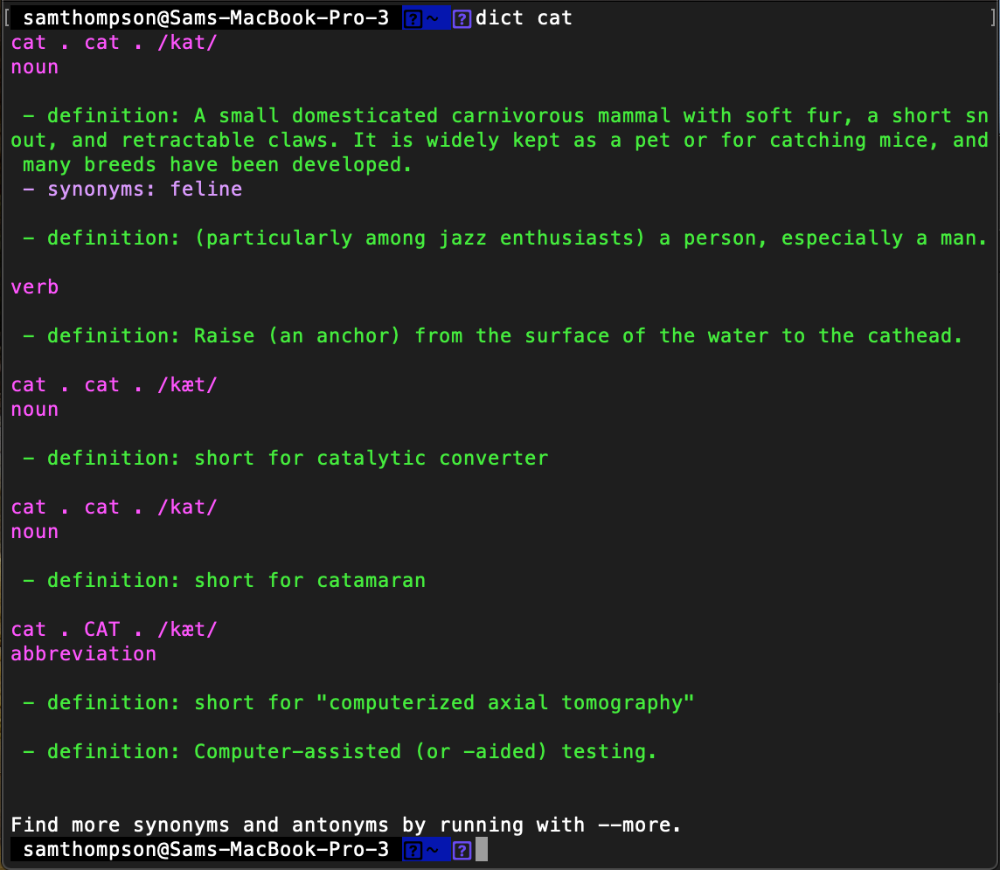

### Google "define" from the command line
====================
Forked from [jyoo's repo](https://github.com/jyoo/command-line-thesaurus)


I love the simplicity of being able to look up words using google's "define {word}" search feature, but sometimes don't want to cutover to a browser to do this. There was at one point an google define API which would have made implementing this a lot easier but it seems to have been de-commed so here we are. This core logic is a python script which leverages Requests to fetch and BeautifulSoup to parse. Terminal color output is supported as well.

Use the provided bash function (below) or call the python script directly.

## Dependencies

* Python>=3.6
* Python modules
    * `requests`
    * `beautifulsoup4`
    * `html5`

## Usage
```
# clone the repo
cd ~/repos
git clone https://github.com/thompsonsed/google_define

# either run directly in python
python google_define.py statement to lookup
# Or add the following function to your .bashrc or .zshrc
dict(){
    python ~/path/to/google_define.py $@
}
# And call using
dict act
```


## Updates
- Added python 3 support
- Better parsing of multiple mearnings, synonyms and antonyms using the [unofficial google dictionary api](https://github.com/meetDeveloper/googleDictionaryAPI)
